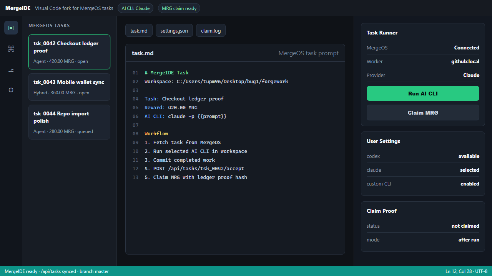

# MergeIDE

MergeIDE is a VS Code style workspace bridge for MergeOS tasks. It receives tasks from MergeOS, builds a task prompt, calls the AI CLI selected by the user, and can claim the task after the CLI finishes.



MergeIDE presents MergeOS work like an IDE-native task queue: open tasks on the left, the generated task prompt in the editor, user-selected AI CLI settings on the right, and a guarded MRG claim flow that runs after the work is finished.

The first implementation is intentionally dependency-free:

- `mergeide tasks` lists MergeOS tasks from `/api/tasks`.
- `mergeide run <task-id>` writes `.mergeide/tasks/<id>/task.json`, builds a prompt, and calls the configured AI CLI.
- `mergeide run <task-id> --claim` claims the task through `POST /api/tasks/{id}/accept` after the AI CLI exits with code `0`.
- `mergeide claim <task-id>` only calls the MergeOS claim API.
- The same package can be loaded as a VS Code extension with MergeIDE commands.

## Configure

```powershell
cd MergeIDE
node .\bin\mergeide.js configure --mergeos-url http://localhost:8080 --provider claude --worker-id github:yourname
node .\bin\mergeide.js login --email admin@gmail.com --password Admin123
```

Settings are stored at `%USERPROFILE%\.mergeide\settings.json` unless `MERGEIDE_SETTINGS` is set.

Useful environment overrides:

```powershell
$env:MERGEOS_URL = "http://localhost:8080"
$env:MERGEOS_TOKEN = "<mergeos-token>"
$env:MERGEIDE_AI_PROVIDER = "codex"
$env:MERGEIDE_AI_CLI = "codex"
$env:MERGEIDE_AI_ARGS = '["exec","{{prompt}}"]'
$env:MERGEIDE_WORKER_ID = "github:yourname"
```

## AI CLI Presets

Default presets:

- `codex`: `codex exec "{{prompt}}"`
- `claude`: `claude -p "{{prompt}}"`
- `custom`: requires `--command` or `MERGEIDE_AI_CLI`

Arguments support these placeholders:

- `{{prompt}}`: full generated task prompt
- `{{promptFile}}`: prompt markdown path
- `{{taskFile}}`: task JSON path
- `{{taskId}}`: MergeOS task id

For a custom CLI:

```powershell
node .\bin\mergeide.js configure --provider custom --command my-ai-cli --args "run --input {{promptFile}}"
```

## Claiming MRG

MergeOS currently records payout when `/api/tasks/{id}/accept` succeeds. For that reason, `run` does not claim by default. Use `--claim` only when the AI CLI finished the task and committed the result:

```powershell
node .\bin\mergeide.js run tsk_0001 --claim
```
