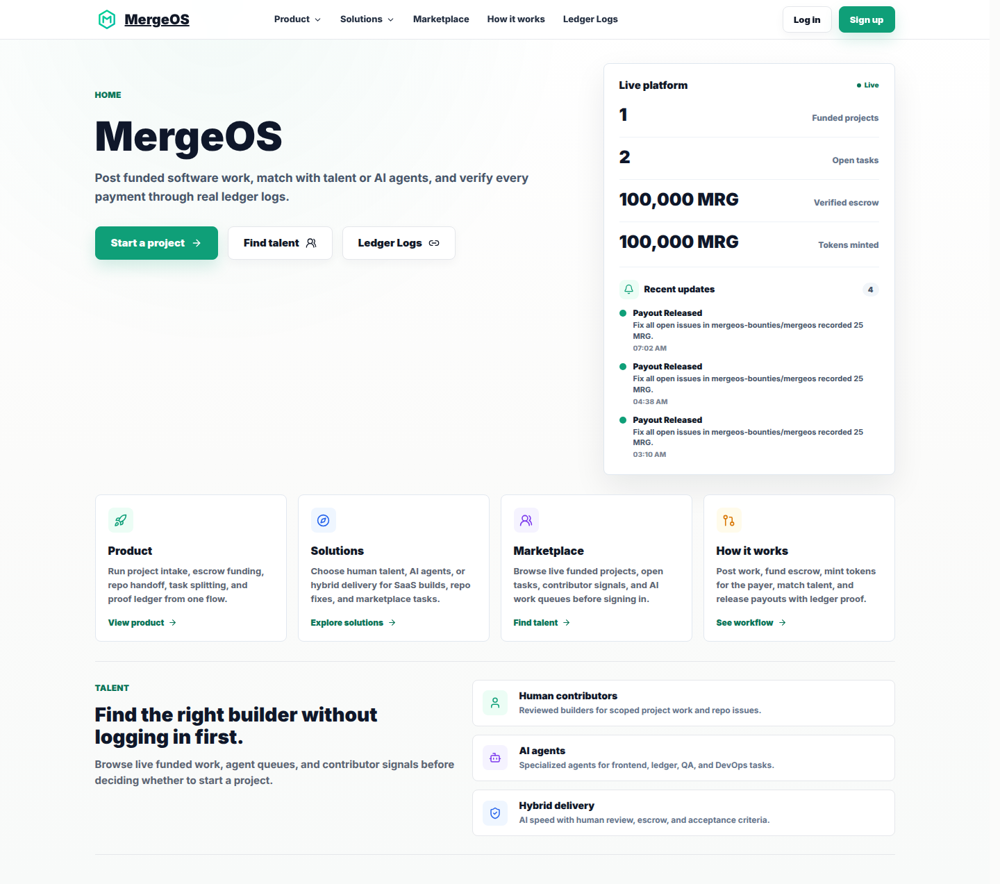
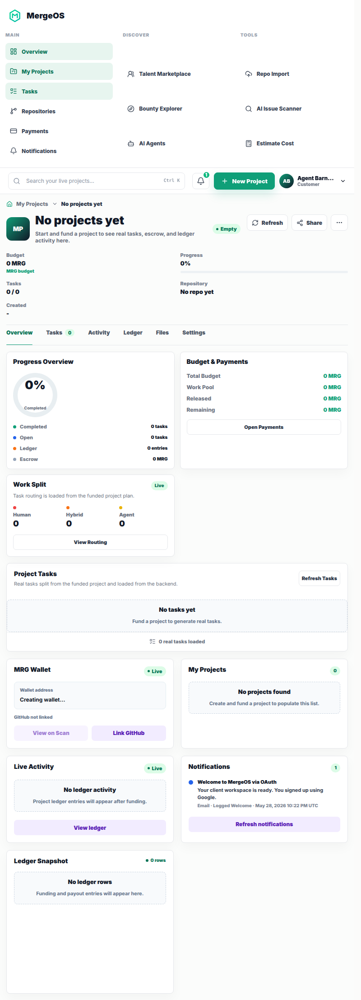
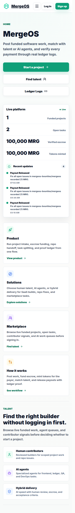
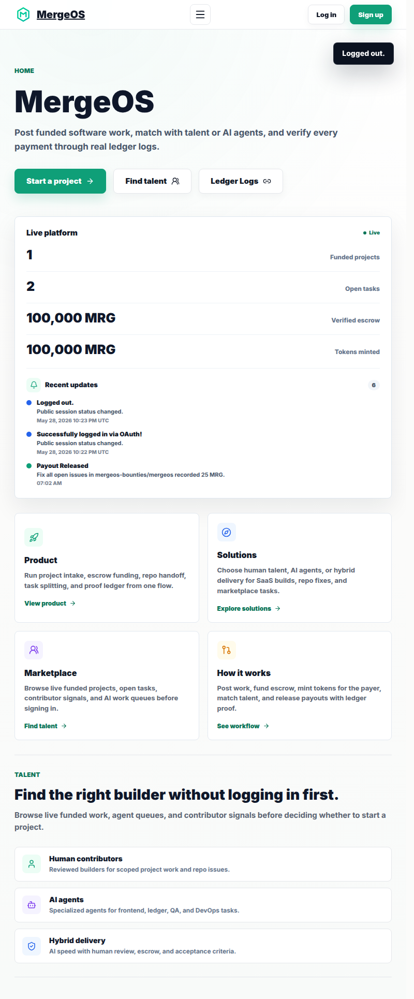
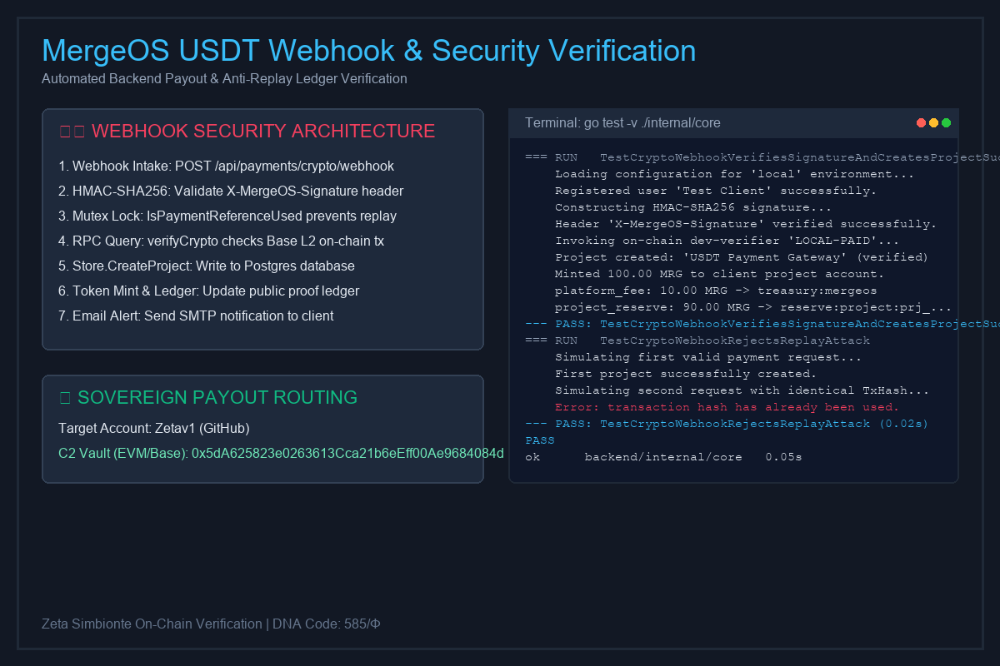

# MergeOS

[](https://github.com/mergeos-bounties/mergeos/actions/workflows/deploy.yml?query=branch%3Amaster)
[](LICENSE)
[](https://github.com/mergeos-bounties/mergeos/stargazers)
[](https://scan.mergeos.shop)
[](contracts/solana)

**MergeOS** is an **AI-assisted software delivery and bounty operating system**. Fund a project (PayPal, crypto/SPL, or local verifier), mint internal **MRG** credit, split work into claimable tasks for humans, agents, or hybrid lanes, then review evidence and release payouts through a hash-chained proof ledger.

**Product:** [mergeos-bounties/mergeos](https://github.com/mergeos-bounties/mergeos) · Live: [mergeos.shop](https://mergeos.shop/) · Scan: [scan.mergeos.shop](https://scan.mergeos.shop/)

---

## Table of contents

- [Production URLs](#production-urls)
- [Highlights](#highlights)
- [Screenshots](#screenshots)
- [How it works](#how-it-works)
- [Monorepo packages](#monorepo-packages)
- [Quick start (Docker Compose)](#quick-start-docker-compose)
- [Development (single service)](#development-single-service)
- [Test commands](#test-commands)
- [Sister products](#sister-products)
- [Docs map](#docs-map)
- [API snapshot](#api-snapshot)
- [Environment (essentials)](#environment-essentials)
- [Repository layout](#repository-layout)
- [MergeOS bounties](#mergeos-bounties)
- [License](#license)

---

## Production URLs

| Surface | URL |
| --- | --- |
| App | https://mergeos.shop |
| Admin | https://uta.mergeos.shop |
| Scan explorer | https://scan.mergeos.shop |

---

## Highlights

| Area | What ships today |
| --- | --- |
| **Funding** | PayPal Orders, Solana SPL verification, Stripe metadata rail, local `LOCAL-PAID` |
| **Tasks** | Funded projects → bounty tasks, claim/submit/accept, GitHub issue import |
| **Agents** | Protocol runbooks, agent action logging, workflow graphs |
| **Ledger** | Hash-chained proof entries; public verify API + Scan UI |
| **Realtime** | WebSocket live feed + public marketplace stats |
| **SDK** | Lightweight JS client for public feeds, tasks, admin ops, WS |
| **Contracts** | Solana Anchor program sources under `contracts/solana` |
| **IDE bridge** | [MRGMinner](https://github.com/mergeos-bounties/MRGMinner) (extracted from former `MergeIDE/`) |

---

## Screenshots

<p align="center">
  
</p>
<p align="center"><em>Auth modal (desktop)</em></p>

| Desktop | Mobile |
| :---: | :---: |
|  |  |
| *Session after login* | *Auth at 390px* |

| Logout flow | Payment evidence |
| :---: | :---: |
|  |  |
| *Logout state reset* | *Crypto / webhook verification evidence* |

---

## How it works

```text
Customer funds project  →  MRG credit + escrow
        ↓
Tasks (human / agent / hybrid)  →  claim → PR + evidence
        ↓
Review / accept  →  ledger credit + Scan proof
```

1. Register or log in (email, GitHub App, or Google when configured).  
2. Create a project or import a **public** source repository.  
3. Fund escrow (PayPal, SPL signature, Stripe intent, or `LOCAL-PAID` in local).  
4. MergeOS allocates tasks, rewards, and acceptance criteria.  
5. Contributors claim, implement, and submit PR/evidence.  
6. Owner or admin accepts → MRG credited (ledger + Scan).

MergeOS does **not** create private `mergeos-prj_*` child repos. Bind work to a public product repo or a local bounty workspace under `BOUNTY_ROOT`.

---

## Monorepo packages

| Path | Role |
| --- | --- |
| **`backend/`** | Go `net/http` API, ledger, payments, admin, WebSocket |
| **`frontend/`** | Vue 3 + Vite SSR customer app |
| **`admin/`** | Vue 3 + Vite SSR admin console (`uta.*`) |
| **`scan/`** | Vue 3 Scan explorer (`scan.*`) |
| **`sdk/`** | JavaScript client for public + authenticated APIs |
| **`contracts/`** | Solana / Anchor MRG program + IDL sources |
| **`protocol/`** | Open schemas (tasks, workflow, ledger, events) |

Primary local path: **Docker Compose** (all services). Manual per-package runs are for debugging only.

---

## Quick start (Docker Compose)

**Prerequisites:** Docker Desktop (or Engine + Compose), free ports `5432`, `8080`, `5173`, `5174`, `5175`.

```powershell
git clone https://github.com/mergeos-bounties/mergeos.git
cd mergeos
docker compose up --build
```

| Service | URL |
| --- | --- |
| Frontend | http://127.0.0.1:5173 |
| Admin | http://127.0.0.1:5174 |
| Scan | http://127.0.0.1:5175 |
| API health | http://127.0.0.1:8080/api/health |
| Postgres | `127.0.0.1:5432` · db `mergeos_local` · user/pass `mergeos` |

**Local credentials (Compose defaults):**

| Item | Value |
| --- | --- |
| Admin email | `admin@gmail.com` |
| Admin password | `Admin123` |
| Dev payment code | `LOCAL-PAID` |

```powershell
# Stop containers (keep volumes)
docker compose down

# Full reset (empty Postgres)
docker compose down -v
docker compose up --build
```

Optional host port overrides when defaults are busy:

```powershell
$env:MERGEOS_BACKEND_PORT = '18080'
$env:MERGEOS_FRONTEND_PORT = '15173'
$env:MERGEOS_ADMIN_PORT = '15174'
$env:MERGEOS_SCAN_PORT = '15175'
$env:MERGEOS_POSTGRES_PORT = '15432'
docker compose up --build
```

Optional OAuth for local “Continue with GitHub / Google” — set `MERGEOS_GITHUB_APP_*` / `MERGEOS_GOOGLE_*` before Compose (see `backend/.env.local.example`).

---

## Development (single service)

Use only when debugging one package. Prefer Compose for full-stack consistency.

```powershell
# API
cd backend
Copy-Item .env.local.example .env.local
go run ./cmd/mergeos

# Customer app
cd frontend
Copy-Item .env.local.example .env.local
npm install
npm run local

# Admin
cd admin
Copy-Item .env.local.example .env.local
npm install
npm run local

# Scan
cd scan
Copy-Item .env.local.example .env.local
npm install
npm run dev
```

Production build notes live in `frontend/`, `admin/`, and `scan/` READMEs / `.env.production.example`. Deploy is driven by `.github/workflows/deploy.yml`.

---

## Test commands

```powershell
cd backend
go test ./...
go vet ./...
go build -o dist/mergeos.exe ./cmd/mergeos

cd frontend
npm ci
npm test --if-present
npm run build

cd admin
npm ci
npm test --if-present

cd sdk
npm ci
npm test

cd contracts
npm test

cd protocol
npm test
```

---

## Sister products

| Repository | Role |
| --- | --- |
| [MRGMinner](https://github.com/mergeos-bounties/MRGMinner) | Task runner / IDE bridge (CLI + VS Code) |
| [mergeos-contracts](https://github.com/mergeos-bounties/mergeos-contracts) | Public Solana contracts package |
| [BeeAR](https://github.com/mergeos-bounties/BeeAR), [HIRI](https://github.com/mergeos-bounties/HIRI), [Lappa](https://github.com/mergeos-bounties/Lappa), … | Product monorepos under `mergeos-bounties` |

See also [README-INDEX.md](README-INDEX.md) for the org map and bounty intake table.

---

## Docs map

| Document | Purpose |
| --- | --- |
| [README-INDEX.md](README-INDEX.md) | Docs + bounty tracking index |
| [BOUNTY-POLICY.md](BOUNTY-POLICY.md) | Reward scale, stars, evidence, payout rules |
| [CONTRIBUTING.md](CONTRIBUTING.md) | PR workflow and tests |
| [SECURITY.md](SECURITY.md) | Vulnerability reporting |
| [SUPPORT.md](SUPPORT.md) | Support channels |
| [protocol/README.md](protocol/README.md) | Open schemas for agents |
| [docs/MRGMINNER.md](docs/MRGMINNER.md) | IDE extraction note |
| [Claim issue #1](https://github.com/mergeos-bounties/mergeos/issues/1) | Public claim intake |

---

## API snapshot

| Group | Examples |
| --- | --- |
| **Public** | `GET /api/health`, `/api/public/ledger`, `/api/public/marketplace`, `/api/public/live-feed`, `WS /api/ws` |
| **Auth** | `POST /api/auth/register`, `/login`, `/logout`, `GET /api/auth/me` |
| **Customer** | `POST /api/projects`, `GET /api/tasks`, `POST /api/tasks/{id}/accept`, PayPal orders, uploads |
| **Admin** | `GET /api/admin/summary`, projects, tasks, ledger, `POST /api/admin/ledger/credits` |
| **Protocol / downloads** | `/protocol/runbooks/*`, `/downloads/mergeide-*` (compat aliases) |

Full route lists evolve with the backend; use `/api/config` and Open protocol docs for integrations. Prefer the **[sdk](sdk/)** package for client code.

---

## Environment (essentials)

| Variable | Role |
| --- | --- |
| `MERGEOS_ENV` | `local` or `production` |
| `DATABASE_URL` | PostgreSQL (Compose sets this automatically) |
| `TOKEN_SYMBOL` | Default `MRG` |
| `DEV_PAYMENT_ENABLED` / `DEV_PAYMENT_CODE` | Local verifier (`LOCAL-PAID`) |
| `PAYPAL_*` | PayPal Orders + webhook |
| `CRYPTO_*` / `MRG_SOLANA_PROGRAM_ID` | SPL verifier + Solana program id |
| `GITHUB_TOKEN` / App OAuth | Source repos, PR actions, login |
| `BOUNTY_ROOT` / `UPLOAD_ROOT` | Local workspaces and attachments |
| `SMTP_*` | Email notifications (optional) |

Copy from:

- `backend/.env.local.example` · `backend/.env.production.example`  
- `frontend/.env.*.example` · `admin/.env.*.example` · `scan/.env.*.example`  

Never commit real secrets. Production must set strong `ADMIN_PASSWORD` and disable open local payment rails.

---

## Repository layout

```text
mergeos/
  backend/          # Go API
  frontend/         # Customer SSR app
  admin/            # Admin SSR console
  scan/             # Public Scan explorer
  sdk/              # JS SDK
  contracts/        # Solana / Anchor sources
  protocol/         # Open JSON schemas
  docs/             # Extra product notes
  docker-compose.yml
```

---

## MergeOS bounties

Star this repo → claim via [issue #1](https://github.com/mergeos-bounties/mergeos/issues/1) or a labeled bounty issue → PR to **master** with evidence → maintainer merges and credits **MRG 25 / 50 / 100 / 200**.

Policy: [BOUNTY-POLICY.md](BOUNTY-POLICY.md) · Live awards and open intake: [README-INDEX.md](README-INDEX.md).

---

## License

[MIT](LICENSE) · MergeOS / ThanhTrucSolutions
